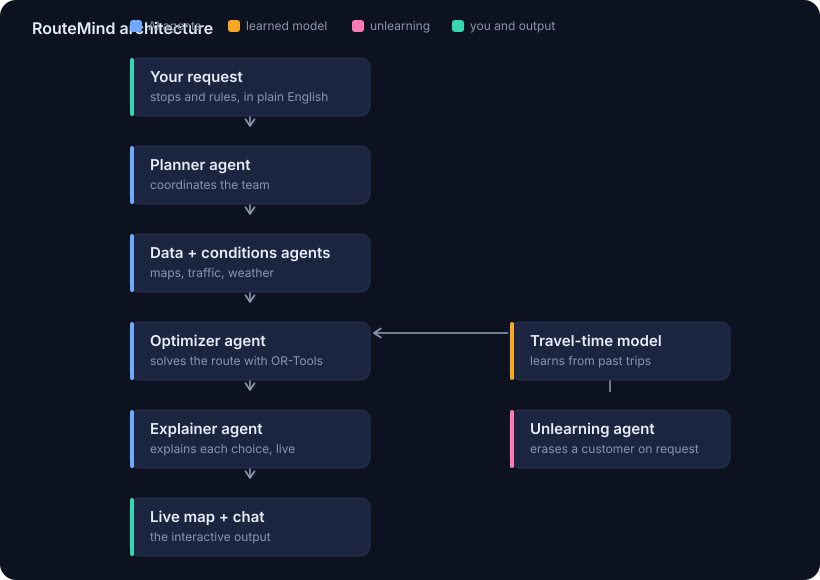

# RouteMind

An interactive route planner where a small team of AI agents plan the smartest driving route and explain every choice, live. You describe your stops and rules in plain English, a real solver does the optimization, and the map redraws as you adjust.

Built for the people who actually plan routes by hand today: a local courier, a florist doing morning drops, a repair tech with a day of house calls, a food bank running a van. They either pay for heavy dispatch software or plan on Google Maps by memory. RouteMind gives them big company routing without the big company cost.



## Why it is built this way

The interesting design decision is what does the thinking. The AI agents handle the language, the coordination, and the plain English explanations. The actual route math is done by Google OR-Tools, a real optimization solver, not by a language model. Letting a language model do routing arithmetic would be slow and unreliable. Knowing when to use an AI model and when to use a proper solver is the whole point of the architecture, and it keeps the answers fast and trustworthy.

So RouteMind is an honest hybrid: agents for language, a solver for math, and a live interface that shows the work.

## What you can do right now (Phases 1 and 2)

- See a set of stops on a live map the moment the app loads.
- Click anywhere on the map to add a stop.
- Set a time window rule on a stop (for example, the pharmacy must be reached between 9 and 11 am).
- Hit **Solver only** and watch the shortest valid order get drawn on the map.
- Hit **Optimize with agents** and watch the five-agent crew work step by step in a live activity panel, then draw the same optimized route with a plain-English explanation.
- Read the total distance, the drive time, and which rules were binding.

### The agent crew (Phase 2)

LangGraph wires five agents into a pipeline; only the optimizer touches the real math.

| Agent | Job |
| --- | --- |
| Planner | States the plan for turning the stops into a route. |
| Data | Confirms the stops are ready for routing. |
| Conditions | Restates the time window rules in plain English. |
| Optimizer | Calls the OR-Tools solver — the one agent that does real math. |
| Explainer | Explains the finished route to a non-technical user. |

The language work runs on a fast Claude model (`claude-haiku-4-5` by default). The steps stream to the browser over Server-Sent Events. Set your key in `backend/.env` to use a real model; without a key the agents fall back to deterministic template text so the app still runs.

Backend endpoints added in Phase 2:

- `POST /optimize/agents` — run the whole crew once, return the final state.
- `POST /optimize/agents/stream` — stream each agent's step live (SSE).

## Build phases

Phase 1 is complete and runnable. The later phases layer on top of this same foundation.

- [x] Phase 1: the map and the solver. Add stops, respect time window rules, draw the optimized route.
- [x] Phase 2: the agents. LangGraph plus a fast language model coordinate the planner, data, conditions, optimizer, and explainer agents, and stream their steps into a live activity panel.
- [ ] Phase 3: the chat. Say "put the school last" or "avoid the toll road" and watch the route redraw, with the explainer telling you what changed and what it cost.
- [ ] Phase 4: learning and unlearning. A small model learns real travel and service times from past trips, and an unlearning agent removes a single customer's influence from that model on request, so the system stays privacy compliant when someone exercises their right to be forgotten.

## Tech stack

- Frontend: Next.js 14, TypeScript, React, Leaflet with OpenStreetMap tiles.
- Backend: FastAPI (Python) with Google OR-Tools for the optimization.
- Later phases: LangGraph for the agent graph, a fast hosted language model for the agents, and scikit-learn for the learned travel time model.

## Getting started

You run two small programs, the Python backend and the Next.js frontend, each in its own terminal. When you open the frontend in your browser, you are looking at the finished result.

### 1. Backend

```bash
cd backend
python -m venv .venv
source .venv/bin/activate        # on Windows: .venv\Scripts\activate
pip install -r requirements.txt
cp .env.example .env             # optional: paste an ANTHROPIC_API_KEY for real Claude agents
uvicorn app:app --reload --port 8000 --env-file .env
```

The API is now live at http://127.0.0.1:8000. You can open that address to see a health check.

### 2. Frontend

In a second terminal:

```bash
cd frontend
cp .env.local.example .env.local
npm install
npm run dev
```

Open http://localhost:3000 and you will see the map with seeded stops. Click Optimize.

## Project structure

```
routemind/
├── backend/
│   ├── app.py            FastAPI app, the /optimize and agent endpoints
│   ├── solver.py         OR-Tools route solver and distance math
│   ├── agents.py         the LangGraph agent crew (Phase 2)
│   └── requirements.txt
├── frontend/
│   └── app/
│       ├── page.tsx      main screen, state, and the control panel
│       ├── layout.tsx
│       ├── globals.css   the dispatch console styling
│       ├── components/
│       │   └── MapView.tsx   Leaflet map, numbered pins, route line
│       └── lib/
│           ├── api.ts        calls the backend
│           └── types.ts
└── docs/
    └── architecture.svg
```

## Notes on realism

Phase 1 uses straight line distance and a fixed average speed to estimate travel times, which keeps it dependency free and instant. Moving to production means swapping in real road distances from a routing service and a live traffic feed. The design does not change, only the data source behind the numbers, and that is exactly the difference between a working demo and a shipped product.

## License

MIT. See [LICENSE](LICENSE).
